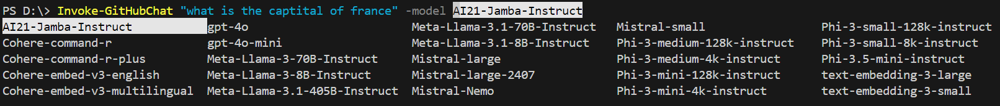
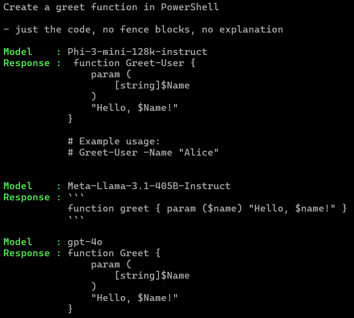

[](https://twitter.com/dfinke)
[](https://youtube.com/@dougfinke/)

[](https://www.powershellgallery.com/packages/PSGitHubChat)
[](https://www.powershellgallery.com/packages/PSGitHubChat)
[](https://github.com/dfinke/PSGitHubChat/releases)
[](https://github.com/dfinke/PSGitHubChat/blob/master/LICENSE)

# PowerShell GitHub Chat

Enhance your workflow with PowerShell GitHub Chat. This tool lets you test a variety of AI models, each with its own flair and specialty. 

## Installation

```powershell
Install-Module -Name PSGitHubChat
```

Just like picking the perfect tool, this command adds AI to your PowerShell toolbox.

## Your GitHub Private Access Token

To enter this AI party, you'll need a GitHub personal access token. Think of it as your backstage pass to the world of AI models.

- Create your token (no fancy permissions needed)
["Managing your personal access tokens."](https://docs.github.com/en/authentication/keeping-your-account-and-data-secure/managing-your-personal-access-tokens)
- Tuck it away in an environment variable: `$env:GITHUB_TOKEN`

## Fire When Ready

Once your token is saved as an environment variable, you're ready to start chatting with the models:

```powershell
Invoke-GitHubChat "What's the hottest trend in AI right now?"
```

## Model Options

Why stick to one when you can try them all? Use tab completion to easily switch between models:

1. Type `-model`
2. Hit `ctrl+space`
3. Arrow through your options
4. Make your selection with `enter`

<br/>



It's like having a personal AI stylist at your fingertips!

## Mix and Match

Experiment with different prompts and models. Find the perfect combination that makes your code pop:

```powershell
Invoke-GitHubChat "Give me a catchy slogan for PowerShell" -model Mistral-large 
```

Remember, in the world of PowerShell GitHub Chat, your code isn't just functional – it's AI enabled. So go ahead, make your PowerShell smart - AI smart!

## Explore 

Try different prompts and see how the models respond. You can use the `-model` parameter to switch between models.

Experimenting this way you can find the model that best suits your needs, both in terms of the quality of the responses and the speed of the model.

```powershell
Invoke-GitHubChat "First 5 US presidents - in a table" -model Phi-3-mini-128k-instruct 
```

## Try Different Models - In a Script

You can also try different models in a script using the same prompt. Then compare the responses side by side. 

```powershell
$models = "Phi-3-mini-128k-instruct", "Meta-Llama-3.1-405B-Instruct", "gpt-4o"

$prompt = @"
Create a greet function in PowerShell

- just the code, no fence blocks, no explanation
"@

$result = foreach ($model in $models) {
    [PSCustomObject][Ordered]@{
        Model    = $model
        Response = Invoke-GitHubChat -Prompt $prompt -Model $model
    }            
}

$prompt
$result | Format-List
```

## Results



## My Other AI PowerShell Modules

- PowerShell OpenAI AI module: PSAI. Think ChatGPT meets PowerShell, in your console.

    - Install it with `Install-Module PSAI`
    - GitHub: https://github.com/dfinke/PSAI

